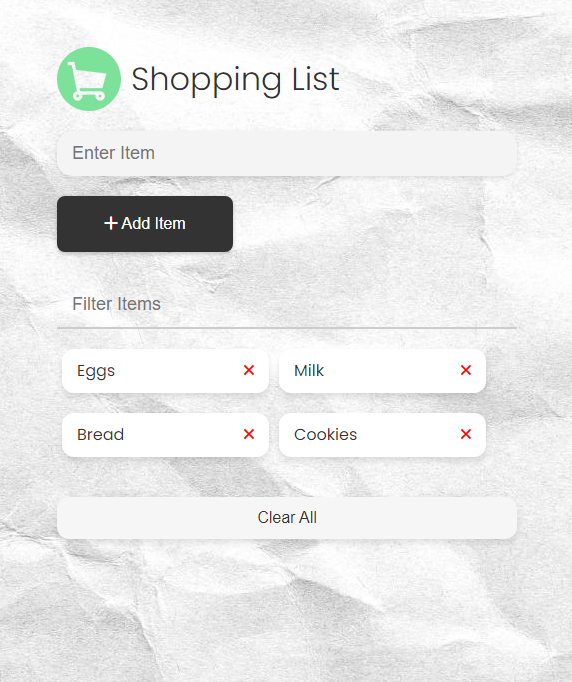

# 🛍 Shopping List

An intuitive shopping list application built with vanilla JavaScript.

## 🌟 Features

- 📜 Dynamic manipulation of the DOM.
- 🖱️ Event handling for seamless user interactions.
- 💾 Local storage integration to save and retrieve list items.
- ⚙️ Efficient management of the application state.

## 🚀 Live Preview
Check out the live demo of the app: [Vanilla Shopping List Preview](https://arthurduboks.github.io/vanilla_shop_list/)
